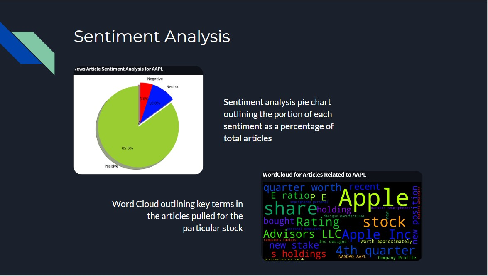
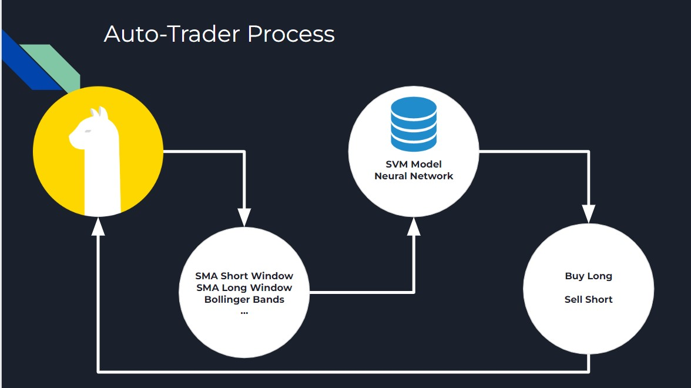
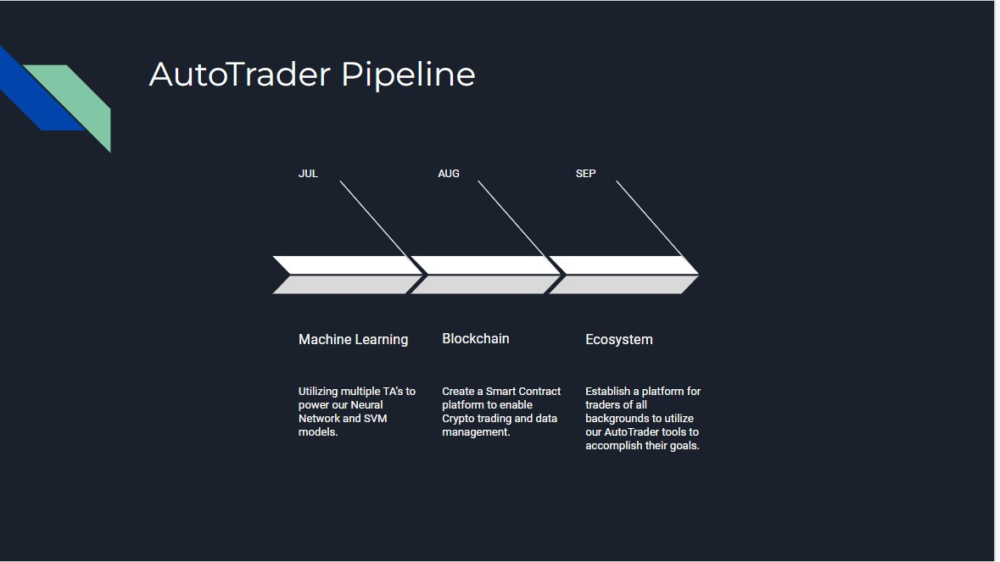

# The AutoTrader Pro

## Overview & Features
Fueled by our success following the deployment of the AutoTrader, we have enhanced and included additional features to our original product and have  dubbed our new creation: "The AutoTrader Pro". The Pro version is more user friendly has all the necessary tools to help our users achieve their ultimate goal, which is to make money.

This Application features the following upgrades:

1. Sentiment Analysis using recent news on any ticker to gauge the current market's sentiment on that ticker.
2. Algorithmic Trading Bot powered by our Machine Learning Models.
3. Intuitive and user friendly User Interface for customers to easily select their preferred stock and begin trading.

### NOTE
* A subscription to utilize Alpaca's Api is needed to run the AutoTrader Pro.
* The AutoTrader Pro can only execute trades during market hours (9:30 AM - 4 PM).

---

## Technologies

The AutoTrader Pro utilizes **Python (v 3.9.7)** and the following libraries (in no specific order):

`1. os 2. alpaca_trade_api as tradeapi 3. ast 4. time 5. json 6. pandas as pd 7. numpy as np 8. load_dotenv from dotenv 9. requests 10. hvplot.pandas 11 sqlalchemy 12. tensorflow as tf 13. Tensorflow.keras.layers 14. Tensorflow.keras.models 15. Sklearn.model_selection 16. Sklearn.preprocessing 17.  alpaca_trade_api 18. talib as ta 19. websocket 20. plotly 21. Datetime 22. matplotlib.pyplot as plt 23. nltk.sentiment.vader 24. GoogleNews 25.  newspaper 26. wordcloud 27. yahoo_fin.stock_info  28. streamlit as st `

---

## Installation Guide

A large majority of the libraries are included with the Python version above. All other libraries can be installed using the Pip Package Manager or using the Conda Forge method.

[PIP Install Support Web Site](https://packaging.python.org/en/latest/tutorials/installing-packages/#ensure-you-can-run-python-from-the-command-line)

---

## Application Sections

1. **Sentiment Analysis**:  In striving to improve the AutoTrader Bot, a key functionality we developed and implemented is our Sentiment Analysis. What does providing our customers with a Sentiment Analysis achieve? The market is a collection of participants who are driven by their primitive instincts of greed and fear. Our enhanced analysis gauges the sentiment of the market regarding the particular stock the user has selected using Natural Language Processing analysis powered by NLTK Vader Library; This analysis allows the user to extrapolate emotive trends that can induce pricing movement and profit. The data collection utilizes the GoogleNews API to fetch top articles relating to the user inputted ticker; the data is parsed and categorized into the applicable sentiment categories which are Positive, Negative and Neutral.

    We then visualize this data in 3 different ways: Categorized tables, a pie chart, and even a word cloud to laser focus what specific words are driving the company’s news. All of this allows the customer to make informed trading decisions, which will actually happen under the purview of our next section which Tao will now share

>________________________________________

**link to the Sentiment Analysis file**

[Sentiment_Analysis](sentiment_analysis.py)

2. **Machine Learing**:  Most traders use multiple Technical Analysis indicators to make trading decisions, But an issue with using multiple indicators is that there might be conflicting signals between indicators or they might miss a signal because there are to many indicators to keep track of. That is where our Algorithmic Trading Bot enhanced by our Machine Learning (ML) Models (SVM or Neural Network) comes into play:

  * We have tested 2 ML models: Support Vector Machine (SVM) and Neural Networks (NN) with our application:      
        
    1.  SVM Models is one of the most robust & widely used models for classification prediction with high accuracy. 

    2.  NN Models were more recently developed, it simulate how our brain works via neurons, it gives us the ability to incorporate the Kelly Criterion for placing trades. Which gives us the functionality to increase the size of our trades/ bets when the odds/signals are in our favor.

 

 >**Summarizing trading strategy:**
  - Extracted min by min stock prices data from Alpaca API.
  - Use TA-Lib to calculate various technical indicators (SMA, EMA, RSI, Bollinger Bands etc).
  - Feed above technical indicators as inputs into SVM & NN models to determine direction of price.
  - Determine how many shares to execute.
  - - For SVM model, always execute a maximum 10 share each time.
    - For NN model, using output probability (0 to 1) to calculate shares to execute (for example, buy 10 shares if output is 1, buy 5 shares if output is 0.75, 0 share if output is 0.5, short 5 shares if output is 0.25 and short 10 shares if output is 0).
  - Pass the “stock ticker”, “buy/sell signal”, “number of shares to execute” to the AutoTrader Pro to execute on the Alpaca trading account.

**link to the NN Algo & SVM Algo files**

[NN_Algo](nn_algo.py)

[SVM_Algo](svm_algo.py)

3. **User Interface**: In designing a product to roll out to general consumers, we have to be cognizant of keeping the end user experience front and center in our design choices. We decided to utilize the Streamlit library to build an interactive financial dashboard to take in user inputs and put the power of our built-in tools in the hands of our customers. With Streamlit, we are able to offer users customizable data about a wealth of companies they might wish to invest in, connect and display innovative sentiment analysis to inform those choices, and fully integrate our AutoTrader Pro to place trades in real time directly from user inputs at the culmination of the app’s flow.

**link to the Streamlit file**

[Streamlit_App](streamlit_app.py)

---

## Development Pipeline

Upon succesful deployment of the AutoTrader Pro, we aim to create a Smart Contract system to not only allow trading of CryptoCurrencies, but to create a verifiable Block Chain that the AutoTrader ecosystem will be fueled by.

Final deployment onto a real trading account will be the penultimate venture before our initial public offering.

---

## Contributors

Contributors for the development and deployment of the AutoTrader Pro include:

1. Ryan Anderson: a) Repository Administrator b) Streamlit Engineer
2. Tao Chen: a) Algorithmic Trading Stategy b) Machine Learning (Neural Network Model, SVM Model)
3. James Handral: a) Sentiment Analysis b) README
4. Colton Mayes: a) Streamlit Engineer b) Final Presentation Preparation
5. Anton Maliksi: a)  Final Presentation b)  README
    
---

## Licenses

No licenses were used for the AutoTrader Pro.
